# Laboratorios de Ciberseguridad

**Autor:** Omar Alexander Coria Ramírez

**Carrera:** Ingeniería en Informática

**Asignatura:** Ciberseguridad

---

## Descripción

Este repositorio documenta los laboratorios prácticos realizados durante la asignatura de Ciberseguridad. Cada laboratorio aborda un escenario distinto de ataque y defensa, mostrando paso a paso los comandos ejecutados, los resultados obtenidos y las medidas de mitigación aplicadas.

El propósito del repositorio es servir como evidencia técnica y guía de referencia sobre los principales mecanismos de seguridad estudiados: firma digital y verificación de integridad, defensa de credenciales con autenticación multifactor, y protocolos de comunicación seguros mediante túneles SSH y VPN.

---

## Entorno de trabajo

| Componente | Detalle |
|---|---|
| Virtualización | VirtualBox (red interna `192.168.56.0/24`) |
| Máquina víctima | Ubuntu Server (`192.168.56.3`) |
| Máquina atacante | Kali Linux (`192.168.56.4`) |
| Herramientas utilizadas | OpenSSL, SHA-256, Nmap, Hydra, Google Authenticator, PAM, OpenSSH, Apache2, Wireshark, WireGuard |
| Diccionario de ataque | `lista` (archivo de contraseñas comunes) |

---

## Estructura del repositorio

```
.
├── README.md
└── Capturas_Informe/
    ├── 01.crear_archivo_y_hash_sha256.png
    ├── 02.generar_llaves_rsa.png
    └── ... (33 imágenes en total)
```

---

## Laboratorio 1 — Configuración de Firma Digital y Verificación de Integridad

### Objetivo

Implementar un mecanismo de verificación de integridad mediante funciones hash SHA-256 y autenticidad mediante firma digital con criptografía asimétrica (RSA). Demostrar que cualquier alteración del archivo invalida tanto el hash como la firma, garantizando la detección automática de modificaciones.

### 1. Crear el archivo y generar la huella digital (hash) con SHA-256

```bash
ip a
echo "monto: 1000" > config_bancaria.txt
sha256sum config_bancaria.txt
```

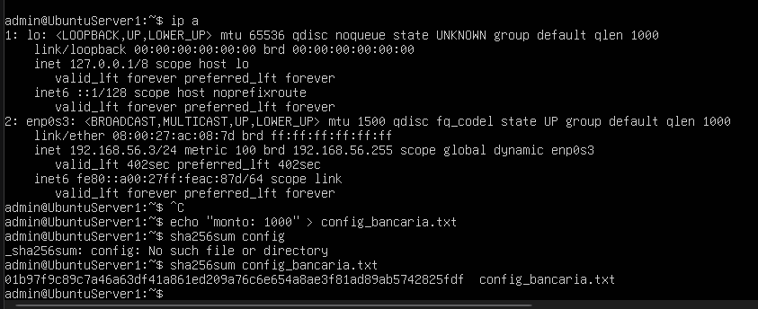

### 2. Generar la llave privada y la llave pública RSA

```bash
openssl genrsa -out privada.pem 2048
openssl rsa -in privada.pem -pubout -out publica.pem
```

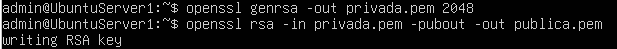

### 3. Listar las llaves generadas

```bash
ls
```

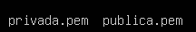

### 4. Crear la firma digital del archivo usando la llave privada

```bash
openssl dgst -sha256 -sign privada.pem -out firma.bin config_bancaria.txt
ls
```

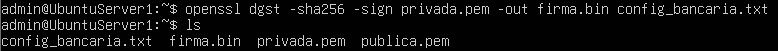

### 5. Verificar la autenticidad del archivo (resultado: `Verified OK`)

```bash
openssl dgst -sha256 -verify publica.pem -signature firma.bin config_bancaria.txt
```

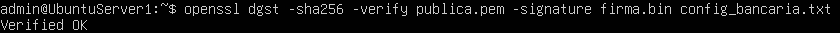

### 6. Alterar el archivo y verificar la firma nuevamente (resultado: `Verification failure`)

```bash
echo "monto: 22u83927193" > config_bancaria.txt
openssl dgst -sha256 -verify publica.pem -signature firma.bin config_bancaria.txt
```

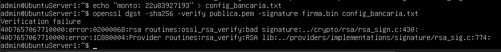

---

## Laboratorio 2 — Ataque y Defensa de Credenciales

### Objetivo

Demostrar la vulnerabilidad del servicio SSH ante un ataque de fuerza bruta con Hydra y aplicar hardening mediante la incorporación de Google Authenticator (TOTP) integrado con PAM, exigiendo un segundo factor de autenticación que neutralice los ataques de diccionario.

### 1. Identificar puertos abiertos y sistema operativo de la víctima con Nmap (desde Kali)

```bash
sudo nmap -sV -O 192.168.56.101
```

**Resultado:** puerto `22/tcp` abierto con `OpenSSH 9.6p1 Ubuntu`.

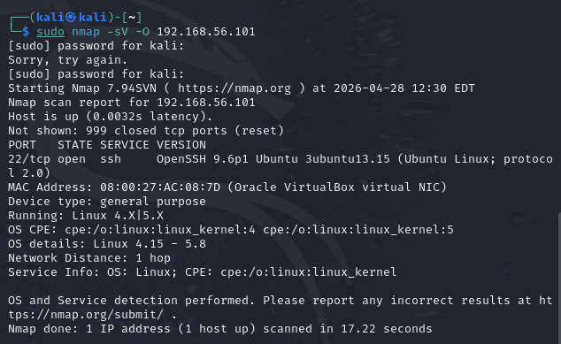

### 2. Ejecutar ataque de fuerza bruta con Hydra contra SSH

```bash
hydra -l victima -P lista ssh://192.168.56.101
```

**Resultado:** `[22][ssh] host: 192.168.56.101 login: victima password: pass123`

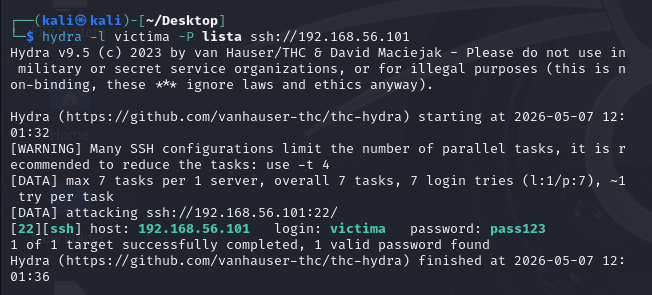

### 3. Instalar el módulo PAM de Google Authenticator (en Ubuntu Server)

```bash
sudo apt install libpam-google-authenticator
```

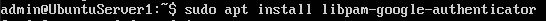

### 4. Iniciar la configuración del autenticador

```bash
google-authenticator
```

Responder `y` a la pregunta sobre tokens basados en tiempo.

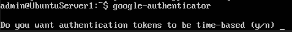

### 5. Escanear el código QR con la aplicación y guardar los códigos de emergencia

Escanear el QR generado en la terminal con la app Google Authenticator e introducir el código de verificación. Se generan códigos de emergencia (scratch codes) para recuperación.

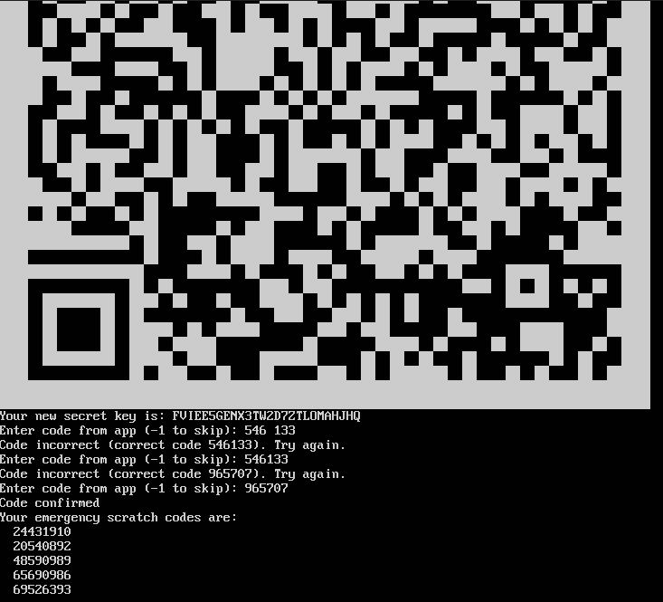

### 6. Editar el archivo PAM para SSH

```bash
sudo nano /etc/pam.d/sshd
```


### 7. Agregar la línea de PAM Google Authenticator al final del archivo

Agregar la siguiente línea al final de `/etc/pam.d/sshd`:

```
auth required pam_google_authenticator.so
```

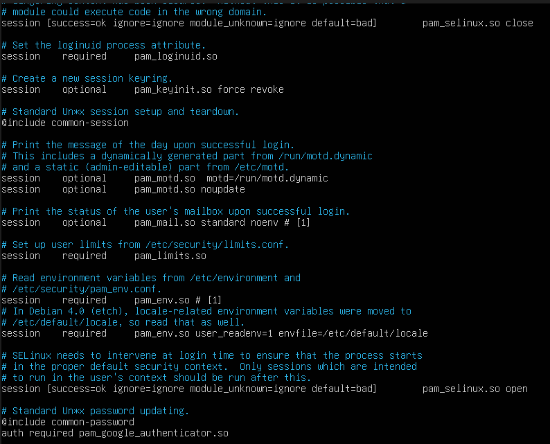

### 8. Editar el archivo `sshd_config` — habilitar `ChallengeResponseAuthentication`

```bash
sudo nano /etc/ssh/sshd_config
```

Configurar:

```
ChallengeResponseAuthentication yes
```

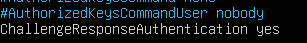

### 9. Habilitar `KbdInteractiveAuthentication` y `UsePAM`

Configurar:

```
KbdInteractiveAuthentication yes
UsePAM yes
```

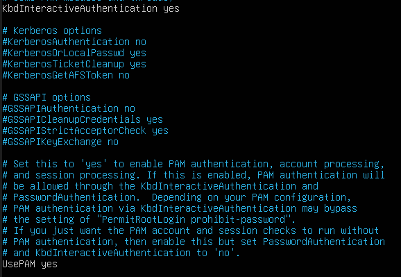

### 10. Definir el método de autenticación

Agregar al final del archivo:

```
AuthenticationMethods keyboard-interactive
```

Reiniciar el servicio SSH:

```bash
sudo systemctl restart ssh
```


### 11. Reintentar el ataque con Hydra — ahora falla (eficiencia del MFA)

```bash
hydra -l victima -P lista ssh://192.168.56.3 -t 4 -v
```

**Resultado:** `1 of 1 target completed, 0 valid password found`

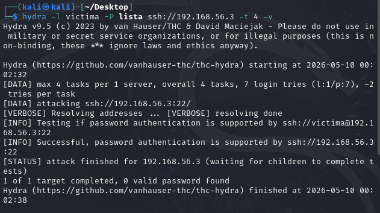

### 12. Intentar acceso por SSH — ahora requiere código de verificación

```bash
ssh victima@192.168.56.3
```

El sistema pide contraseña y código TOTP. Sin el segundo factor: `Permission denied (keyboard-interactive)`.

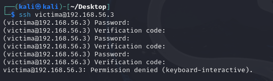

---

## Laboratorio 3 — Protocolos de Comunicación Seguros

### Objetivo

Evidenciar el riesgo de transmitir credenciales en HTTP plano mediante análisis de tráfico con Wireshark, y aplicar dos capas de mitigación: un túnel SSH local para cifrar el acceso a un servicio web, y una VPN con WireGuard usando criptografía de curva elíptica (Curve25519) para cifrar todo el tráfico entre cliente y servidor.

### 1. Crear el archivo HTML del formulario de login

```bash
sudo nano /var/www/html/login.html
```


### 2. Agregar el formulario POST con usuario y contraseña

Contenido del archivo:

```html
<form method="POST" action="login.html">
Usuario: <input type="text" name="user"><br>
Password: <input type="password" name="pass"><br>
<input type="submit" value="Enviar">
</form>
```

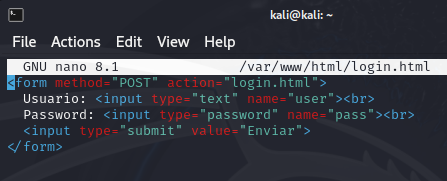

### 3. Iniciar el servidor Apache2

```bash
sudo systemctl start apache2
```


### 4. Abrir Wireshark y seleccionar la interfaz `Loopback: lo`

Iniciar Wireshark y elegir la interfaz Loopback para capturar el tráfico de localhost.

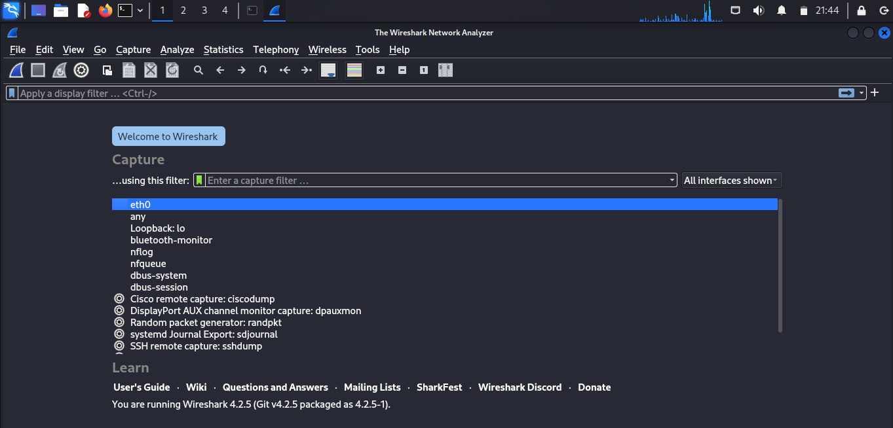

### 5. Filtrar POST en Wireshark y observar credenciales en texto plano

Aplicar el filtro:

```
http.request.method == "POST"
```

**Resultado:** las credenciales aparecen visibles (`user = admin`, `pass = 12345`), demostrando la vulnerabilidad del protocolo HTTP frente al sniffing.

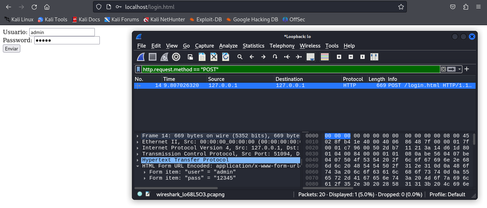

### 6. Crear un túnel SSH local para cifrar el tráfico

```bash
ssh -L 8080:localhost:80 kali@localhost
```

Después acceder a la página por el túnel: `http://localhost:8080`.

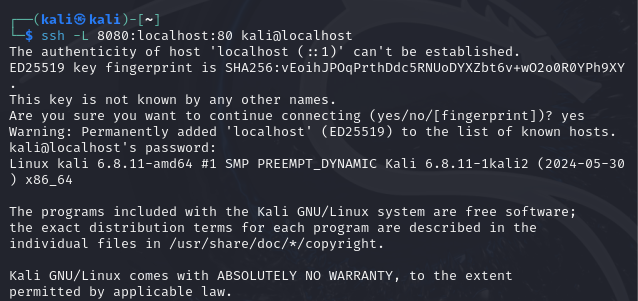

### 7. Verificar en Wireshark que el tráfico ya está cifrado

Al capturar nuevamente, los paquetes aparecen como `SSH - Encrypted packet`, sin posibilidad de leer las credenciales en texto plano.

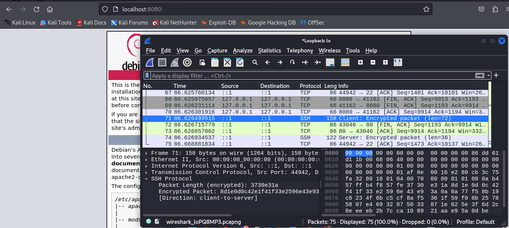

### 8. Implementar VPN con WireGuard — instalación

```bash
sudo apt install wireguard
```

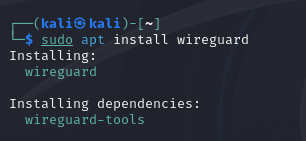

### 9. Generar las llaves WireGuard (criptografía Curve25519)

```bash
sudo su
cd /etc/wireguard
umask 077
wg genkey | tee privatekey | wg pubkey > publickey
```

> Nota: WireGuard utiliza **Curve25519** (criptografía de curva elíptica), distinta a la RSA usada en el Laboratorio 1. Es más moderna, rápida y ofrece seguridad equivalente con llaves más cortas.

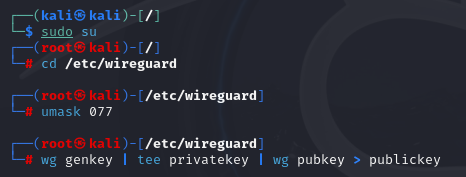

### 10. Mostrar las llaves generadas

```bash
cat /etc/wireguard/privatekey
cat /etc/wireguard/publickey
```

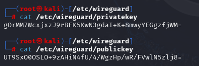

### 11. Crear y editar el archivo de configuración `wg0.conf`

```bash
nano /etc/wireguard/wg0.conf
```

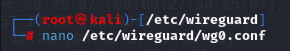

### 12. Configurar la interfaz con la llave privada, dirección IP y puerto

Contenido del archivo `wg0.conf`:

```ini
[Interface]
PrivateKey = <llave_privada_generada>
Address = 10.0.0.1/24
ListenPort = 51820
```

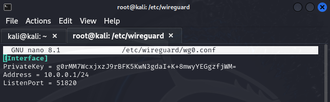

### 13. Activar la VPN WireGuard

```bash
wg-quick up wg0
```

Salida esperada:
```
[#] ip link add dev wg0 type wireguard
[#] wg setconf wg0 /dev/fd/63
[#] ip -4 address add 10.0.0.1/24 dev wg0
[#] ip link set mtu 1420 up dev wg0
```

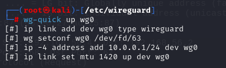
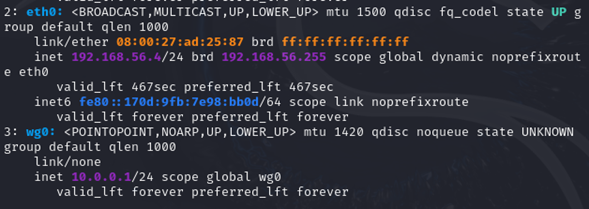
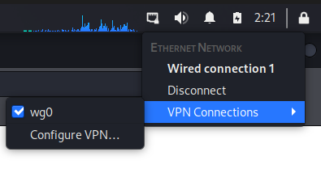

---

## Conclusiones generales

- **Laboratorio 1** demostró que las funciones hash SHA-256 detectan cualquier alteración de un archivo, y que la firma digital RSA refuerza esta protección al garantizar también la autenticidad del origen: un atacante sin la llave privada no puede generar una firma válida.
- **Laboratorio 2** evidenció que SSH protegido únicamente con contraseña es vulnerable a ataques de fuerza bruta con Hydra. La incorporación de un segundo factor (TOTP de Google Authenticator) integrado con PAM neutraliza por completo el ataque, ya que el atacante carece del código generado dinámicamente cada 30 segundos.
- **Laboratorio 3** mostró que HTTP transmite credenciales en texto plano, fácilmente capturables con Wireshark. Un túnel SSH local cifra punto a punto el acceso al servicio web, y una VPN con WireGuard (basada en Curve25519) extiende el cifrado a todo el tráfico entre las máquinas, convirtiendo cualquier intento de sniffing en datos ilegibles.

---

*Repositorio académico — Asignatura de Ciberseguridad*
